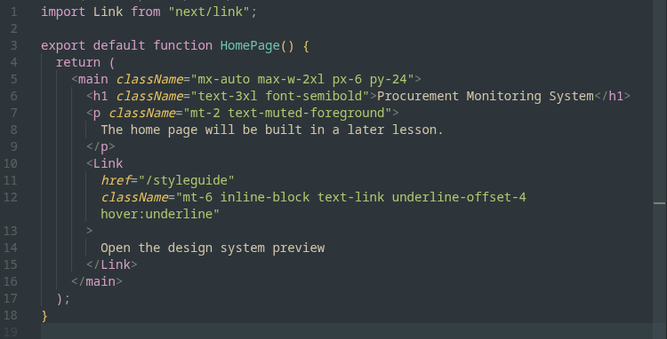
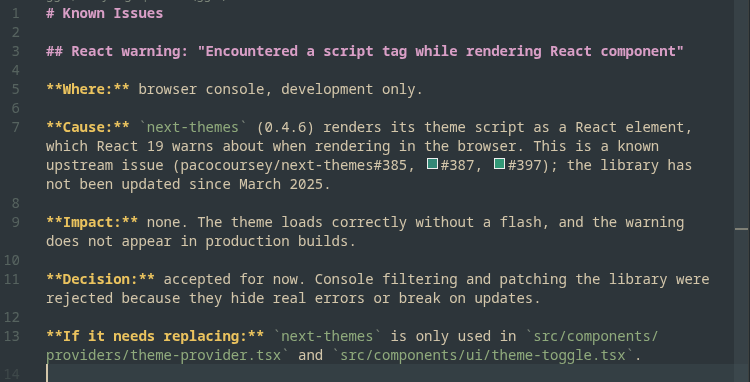

<p align="center">
  
</p>

<h1 align="center">Sagebrush</h1>

<p align="center">A calm, earthy dark theme for VS Code, inspired by <a href="https://github.com/sainnhe/everforest">Everforest</a>.</p>

---





## Features

- Soft forest-gray background with a sage-green accent
- Syntax colors spaced apart so strings, functions, numbers, and keywords are easy to tell apart
- Full Markdown styling: headings, bold, italic, inline code, links, quotes, lists, and code fences
- Matching integrated terminal colors
- Bracket pair colorization and git decoration colors

## Installation

### From a release

1. Download the latest `.vsix` file from the [Releases](https://github.com/sgxtract/sagebrush-theme/releases) page.
2. In VS Code, open the Extensions view, click the `...` menu, and choose **Install from VSIX...**
3. Select the downloaded file.
4. Open the Command Palette (`Ctrl+Shift+P`), run **Preferences: Color Theme**, and pick **Sagebrush**.

### From source

```bash
git clone https://github.com/sgxtract/sagebrush-theme.git
cd sagebrush-theme
npx @vscode/vsce package
code --install-extension sagebrush-theme-*.vsix
```

## Palette

| Color | Hex | Used for |
|---|---|---|
| Background | `#2d353b` | Editor |
| Panels | `#232a2e` | Sidebar, tabs, terminal |
| Foreground | `#d3c6aa` | Text, variables |
| Comments | `#859289` | Comments |
| Green (accent) | `#b3c76e` | Strings, UI accent |
| Sage | `#8faa7c` | Markdown inline code |
| Teal | `#70c4ae` | Functions, regex |
| Blue | `#80b1da` | Types, JSON keys, links |
| Yellow | `#ebc35e` | Numbers, constants, attributes |
| Orange | `#efa072` | Properties |
| Purple | `#d99ec6` | Keywords, tags, headings |
| Red | `#f57a7a` | `this`, decorators, errors |

## Recommended settings

```json
{
  "editor.fontFamily": "'JetBrains Mono', monospace",
  "editor.fontLigatures": true,
  "editor.bracketPairColorization.enabled": true
}
```

## Credits

Color palette based on [Everforest](https://github.com/sainnhe/everforest) by sainnhe. Sagebrush is an independent theme and is not affiliated with the Everforest project.

## License

[MIT](LICENSE)
